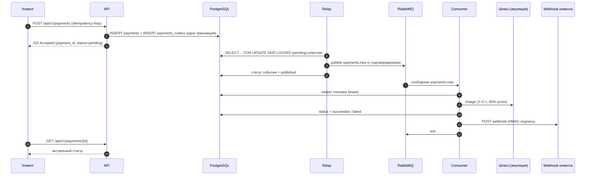

# Асинхронный сервис процессинга платежей

Микросервис принимает запросы на оплату, обрабатывает их асинхронно через эмуляцию внешнего платёжного шлюза и уведомляет клиента о результате через webhook.

Ключевые свойства:

- **Outbox pattern** — платёж и событие о нём записываются в БД в одной транзакции, событие гарантированно попадает в RabbitMQ.
- **Идемпотентность** — повторный запрос с тем же `Idempotency-Key` не создаёт дубль.
- **Retry с экспоненциальной задержкой** — 3 попытки обработки, задержки 5 с → 10 с.
- **Dead Letter Queue** — сообщения, не обработанные за 3 попытки, попадают в `payments.dead`.
- **Подписанные webhook-уведомления** (HMAC-SHA256) с повторной доставкой при сбоях.

## Содержание

1. [Стек](#стек)
2. [Архитектура](#архитектура)
3. [Быстрый старт (Docker)](#быстрый-старт-docker)
4. [Конфигурация](#конфигурация)
5. [API](#api)
6. [Webhook](#webhook)
7. [Как это работает внутри](#как-это-работает-внутри)
8. [RabbitMQ: топология, retry, DLQ](#rabbitmq-топология-retry-dlq)
9. [Команды Makefile](#команды-makefile)
10. [Локальная разработка без Docker](#локальная-разработка-без-docker)
11. [Структура проекта](#структура-проекта)
12. [Решение проблем](#решение-проблем)

## Стек

| Компонент | Технология |
|---|---|
| API | FastAPI + Pydantic v2 |
| ORM | SQLAlchemy 2.x (async, драйвер asyncpg) |
| БД | PostgreSQL 16 |
| Брокер | RabbitMQ 3.13 + FastStream |
| Миграции | Alembic |
| HTTP-клиент (webhook) | httpx |
| Логирование | structlog (файл + stdout) |
| Окружение | Docker, docker-compose, Poetry, Python 3.14 |

## Архитектура

В `docker-compose` поднимается шесть контейнеров:

| Сервис | Назначение |
|---|---|
| `postgres` | хранилище платежей и outbox |
| `rabbitmq` | брокер сообщений (с management UI) |
| `migrate` | одноразовый контейнер: `alembic upgrade head`, затем завершается |
| `api` | HTTP API (создание и получение платежа) |
| `relay` | читает таблицу outbox и публикует события в RabbitMQ |
| `consumer` | обрабатывает платежи, обновляет статус, шлёт webhook |

Путь платежа:



## Быстрый старт (Docker)

### Требования

- Docker с плагином Compose v2 (`docker compose`)
- `make` (необязательно, но удобно)

### Шаги

```bash
# 1. Создать .env из шаблона
make env            # или: cp .env.example .env

# 2. Задать секреты в .env
#    API_KEY        — ключ для заголовка X-API-Key
#    WEBHOOK_SECRET — секрет для подписи webhook
#    Сгенерировать значение:  openssl rand -hex 32

# 3. Собрать образ и запустить весь стек
make up
```

То же самое без `make`:

```bash
docker compose -f docker/app/docker-compose.yml --env-file .env up -d --build
```

> Флаг `--env-file .env` обязателен: compose-файл лежит в `docker/app/`, и без флага переменные `${POSTGRES_USER}` и другие не подставятся.

Порядок старта обеспечивают `healthcheck` и `depends_on`: `postgres` и `rabbitmq` → `migrate` (миграции) → `api`, `relay`, `consumer`.

### Проверка

```bash
make ps                       # все сервисы Up, migrate — Exited (0)
curl -i http://localhost:8000/docs
```

| Что | Адрес |
|---|---|
| Swagger UI | http://localhost:8000/docs |
| API | http://localhost:8000/api/v1 |
| RabbitMQ Management | http://localhost:15672 (логин и пароль — `RABBITMQ_USER` / `RABBITMQ_PASSWORD` из `.env`) |
| PostgreSQL | `localhost:5432` |

### Остановка

```bash
make down      # остановить, данные сохраняются
make clean     # остановить и УДАЛИТЬ данные postgres и rabbitmq
```

## Конфигурация

Все настройки задаются переменными окружения (файл `.env`). Шаблон — `.env.example`. Файл `.env` содержит секреты и **не должен попадать в git**.

### Обязательные

| Переменная | Описание |
|---|---|
| `APP_NAME`, `APP_VERSION`, `APP_SUMMARY`, `APP_DESCRIPTION` | метаданные приложения (отображаются в Swagger) |
| `APP_SWAGGER_PATH` | путь к Swagger UI, по умолчанию `/docs` |
| `API_KEY` | статический ключ для заголовка `X-API-Key` |
| `WEBHOOK_SECRET` | секрет для HMAC-подписи webhook |
| `POSTGRES_HOST`, `POSTGRES_PORT`, `POSTGRES_USER`, `POSTGRES_PASSWORD`, `POSTGRES_DB` | подключение к PostgreSQL |
| `RABBITMQ_HOST`, `RABBITMQ_PORT`, `RABBITMQ_USER`, `RABBITMQ_PASSWORD`, `RABBITMQ_MANAGEMENT_PORT` | подключение к RabbitMQ |

В Docker `POSTGRES_HOST=postgres` и `RABBITMQ_HOST=rabbitmq` (имена сервисов compose). При локальном запуске без Docker — `localhost`.

### Необязательные (значения по умолчанию)

| Переменная | По умолчанию | Описание |
|---|---|---|
| `API_PORT` | `8000` | порт API на хосте |
| `API_WORKERS` | `2` | число воркеров uvicorn |
| `MAX_ATTEMPTS` | `3` | число попыток обработки сообщения до отправки в DLQ |
| `RETRY_BASE_DELAY_SECONDS` | `5` | базовая задержка retry; n-я задержка = `base · 2^(n-1)` |
| `PROCESSING_SECONDS` | `60` | время «аренды» платежа воркером (защита от параллельной обработки) |
| `CONSUMER_PREFETCH` | `20` | сколько сообщений consumer берёт из очереди одновременно |
| `CONSUMER_GRACEFUL_TIMEOUT_SECONDS` | `30` | ожидание завершения текущих задач при остановке |
| `GATEWAY_MIN_DELAY_SECONDS` / `GATEWAY_MAX_DELAY_SECONDS` | `2` / `5` | диапазон задержки эмуляции шлюза |
| `GATEWAY_SUCCESS_RATE` | `0.9` | вероятность успешного платежа |
| `WEBHOOK_TIMEOUT_SECONDS` | `5` | таймаут отправки webhook (connect — 2 с) |
| `OUTBOX_BATCH_SIZE` | `200` | размер пачки событий за один проход relay |
| `OUTBOX_POLL_INTERVAL_SECONDS` | `0.2` | пауза между проходами relay, когда событий нет |
| `OUTBOX_RETENTION_HOURS` | `24` | сколько хранить опубликованные события |
| `OUTBOX_CLEANUP_INTERVAL_SECONDS` | `300` | как часто чистить опубликованные события |
| `LOG_LEVEL` | `INFO` | `DEBUG`, `INFO`, `WARNING`, `ERROR` |
| `LOG_DIR` / `LOG_FILENAME` | `logs` / `app.log` | каталог и имя файла логов |
| `LOG_CONSOLE` | `False` | дублировать логи в stdout (в Docker включено) |
| `LOG_PER_PROCESS` | `False` | отдельный файл логов на процесс (в Docker включено) |
| `LOG_QUEUE_SIZE` | `100000` | размер очереди асинхронного логгера |
| `LOG_BACKUP_DAYS` | `14` | сколько дней хранить логи |

> Переменные `POSTGRES_PORT` и `RABBITMQ_PORT` используются одновременно как порт на хосте и как порт внутри сети compose. Оставляйте значения `5432` и `5672`: если изменить одну из них, приложение перестанет находить сервис в Docker-сети.

## API

Базовый путь: `/api/v1`. Интерактивная документация — `/docs`.

### Аутентификация

Все эндпоинты требуют заголовок `X-API-Key` со значением `API_KEY` из `.env`. Без него или с неверным ключом возвращается `401`.

Для примеров ниже:

```bash
export API_KEY="<значение API_KEY из .env>"
```

### Формат ответов

Все ответы приходят в едином конверте:

```json
{
  "status": true,
  "message": "Платеж принят",
  "data": { }
}
```

При ошибке `status` равен `false`, а `data` — `null` (для ошибок валидации `data` содержит список полей).

### `POST /api/v1/payments` — создание платежа

**Заголовки**

| Заголовок | Обязательный | Описание |
|---|---|---|
| `X-API-Key` | да | ключ API |
| `Idempotency-Key` | да | уникальный ключ запроса, 1–255 символов (рекомендуется UUID) |
| `Content-Type` | да | `application/json` |

**Тело запроса**

| Поле | Тип | Описание |
|---|---|---|
| `amount` | decimal | сумма, больше 0, до 2 знаков после запятой |
| `currency` | string | `RUB`, `USD` или `EUR` |
| `description` | string | описание, 1–500 символов |
| `metadata` | object | произвольный JSON, до 16 КБ (необязательное, по умолчанию `{}`) |
| `webhook_url` | string | URL (http/https), на который придёт уведомление |

Неизвестные поля в теле запроса отклоняются (`422`).

**Пример**

```bash
curl -X POST http://localhost:8000/api/v1/payments \
  -H "X-API-Key: $API_KEY" \
  -H "Idempotency-Key: $(uuidgen)" \
  -H "Content-Type: application/json" \
  -d '{
    "amount": "1500.50",
    "currency": "RUB",
    "description": "Оплата заказа №42",
    "metadata": {"order_id": "42", "customer": "ivan@example.com"},
    "webhook_url": "https://webhook.site/<ваш-uuid>"
  }'
```

**Ответ `202 Accepted`**

```json
{
  "status": true,
  "message": "Платеж принят",
  "data": {
    "payment_id": "0f6c1b0e-6a52-4a1e-9d3a-3c1f6f0f7b11",
    "status": "pending",
    "created_at": "2026-10-08T10:15:30.123456Z"
  }
}
```

### `GET /api/v1/payments/{payment_id}` — информация о платеже

```bash
curl http://localhost:8000/api/v1/payments/0f6c1b0e-6a52-4a1e-9d3a-3c1f6f0f7b11 \
  -H "X-API-Key: $API_KEY"
```

**Ответ `200 OK`**

```json
{
  "status": true,
  "message": "Платеж успешно получен",
  "data": {
    "payment_id": "0f6c1b0e-6a52-4a1e-9d3a-3c1f6f0f7b11",
    "idempotency_key": "5b8c0f7e-2a3d-4f5e-8c1a-9d7e6b5a4c3d",
    "amount": "1500.50",
    "currency": "RUB",
    "description": "Оплата заказа №42",
    "metadata": {"order_id": "42", "customer": "ivan@example.com"},
    "status": "succeeded",
    "webhook_url": "https://webhook.site/<ваш-uuid>",
    "created_at": "2026-10-08T10:15:30.123456Z",
    "processed_at": "2026-10-08T10:15:34.456789Z"
  }
}
```

Статусы платежа: `pending` → `succeeded` или `failed`.

### Идемпотентность

| Ситуация | Результат |
|---|---|
| Новый `Idempotency-Key` | `202`, платёж создан |
| Тот же ключ и **то же** тело запроса | `202` с данными уже созданного платежа и заголовком `Idempotent-Replayed: true`; новый платёж и событие не создаются |
| Тот же ключ, но **другое** тело запроса | `409 Conflict` |
| Два одновременных запроса с одним ключом | БД гарантирует уникальность (`UNIQUE` + `ON CONFLICT DO NOTHING`): создаётся один платёж |

Сравнение тел выполняется по SHA-256 от нормализованных полей запроса (`amount`, `currency`, `description`, `metadata`, `webhook_url`).

### Коды ответов

| Код | Когда |
|---|---|
| `202` | платёж принят (в том числе повторный запрос с тем же ключом и телом) |
| `200` | платёж найден |
| `401` | отсутствует или неверный `X-API-Key` |
| `404` | платёж не найден |
| `409` | `Idempotency-Key` уже использован с другим телом запроса |
| `422` | ошибка валидации (нет `Idempotency-Key`, неверная валюта, сумма ≤ 0 и т. п.) |
| `500` | внутренняя ошибка сервера |

Пример ответа `422`:

```json
{
  "status": false,
  "message": "Ошибка валидации запроса",
  "data": [
    {"field": "body.currency", "message": "Input should be 'RUB', 'USD' or 'EUR'", "type": "enum"}
  ]
}
```

Каждый ответ содержит заголовок `x-request-id` для сквозной трассировки в логах. Можно передать свой `X-Request-Id` (до 64 символов: буквы, цифры, `.`, `_`, `-`).

## Webhook

После обработки платежа consumer отправляет `POST` на `webhook_url`.

### Тело уведомления

```json
{
  "event": "payment.succeeded",
  "payment_id": "0f6c1b0e-6a52-4a1e-9d3a-3c1f6f0f7b11",
  "status": "succeeded",
  "amount": "1500.50",
  "currency": "RUB",
  "description": "Оплата заказа №42",
  "metadata": {"order_id": "42", "customer": "ivan@example.com"},
  "faile_reason": null,
  "created_at": "2026-10-08T10:15:30.123456+00:00",
  "processed_at": "2026-10-08T10:15:34.456789+00:00"
}
```

`event` принимает значения `payment.succeeded` и `payment.failed`. При отказе `faile_reason` содержит причину (например, `"Платеж отклонен"`).

### Заголовки

| Заголовок | Значение |
|---|---|
| `Content-Type` | `application/json` |
| `X-Webhook-Id` | ID платежа |
| `X-Webhook-Timestamp` | Unix-время отправки (секунды) |
| `X-Webhook-Signature` | `sha256=<hex>` |

### Проверка подписи

Подпись — HMAC-SHA256 от строки `"{timestamp}.{сырое тело запроса}"` с ключом `WEBHOOK_SECRET`:

```python
import hashlib
import hmac

def verify(secret: str, timestamp: str, raw_body: bytes, signature_header: str) -> bool:
    expected = hmac.new(
        secret.encode(),
        timestamp.encode() + b"." + raw_body,
        hashlib.sha256,
    ).hexdigest()
    return hmac.compare_digest(f"sha256={expected}", signature_header)
```

Рекомендуется также отклонять уведомления, у которых `X-Webhook-Timestamp` сильно отличается от текущего времени (защита от replay).

### Гарантии доставки и реакция на ответы

Доставка — **at-least-once**: один и тот же webhook может прийти повторно. Получатель должен быть идемпотентным (дедупликация по `payment_id` / `X-Webhook-Id`).

| Ответ получателя | Что делает сервис |
|---|---|
| `2xx` | доставка успешна |
| `408`, `425`, `429`, `5xx`, таймаут, сетевая ошибка | временная ошибка — повторная попытка по схеме retry |
| прочие `4xx`, редиректы `3xx` (редиректы не выполняются) | получатель отклонил webhook — повторов нет, сообщение уходит в DLQ |

Статус платежа в БД фиксируется **до** отправки webhook, поэтому проблемы с доставкой не влияют на результат платежа. Повторная попытка заново платёж не проводит — только повторяет отправку уведомления.

### Как проверить webhook

- Для приёма: сервис [webhook.site](https://webhook.site) — подставьте выданный URL в `webhook_url`.
- Для проверки retry: URL, который отвечает ошибкой, например `https://httpbin.org/status/500`. Сообщение пройдёт цепочку 5 с → 10 с и окажется в `payments.dead`.
- Для приёма на локальной машине из Docker Desktop (macOS/Windows) используйте `http://host.docker.internal:<порт>`. На Linux этот адрес в контейнере по умолчанию недоступен — потребуется `extra_hosts: ["host.docker.internal:host-gateway"]` в compose-файле.

## Как это работает внутри

### Outbox pattern

1. API в **одной транзакции** вставляет строку в `payments` и событие `payment.created` в `payments_outbox`. Либо сохранено и то и другое, либо ничего.
2. Процесс `relay` в цикле выбирает события со статусом `pending` запросом `SELECT ... FOR UPDATE SKIP LOCKED` (несколько экземпляров relay не конфликтуют), публикует их в RabbitMQ с подтверждением (publisher confirm, `persist=True`) и помечает как `published`.
3. Если публикация не удалась, событие остаётся `pending`, в `attempts` и `last_error` записывается причина, и relay пробует снова.
4. Опубликованные события удаляются фоновой очисткой через `OUTBOX_RETENTION_HOURS`.

Событие может быть опубликовано повторно (at-least-once), поэтому consumer идемпотентен.

### Идемпотентный consumer

- Перед обработкой платёж «захватывается»: `UPDATE ... SET processing_started_at = now() WHERE status = 'pending' AND (processing_started_at IS NULL OR processing_started_at < now() - PROCESSING_SECONDS)`. Платёж не может обрабатываться двумя воркерами одновременно. Если воркер упал, через `PROCESSING_SECONDS` платёж можно взять заново.
- Статус меняется только из `pending`: `UPDATE ... WHERE status = 'pending'`. Платёж не может быть проведён дважды.
- Если платёж уже обработан, повторное сообщение пропускает шлюз и только досылает webhook, если он ещё не был доставлен (`webhook_delivered_at IS NULL`).
- Если платёж занят другим воркером, сообщение возвращается в очередь задержки без расхода попыток.

### Эмуляция шлюза

`ExternalPaymentEmulationGateway` ждёт случайное время от 2 до 5 секунд и с вероятностью 90% возвращает успех, иначе — отказ с причиной «Платеж отклонен». Отказ шлюза — это **штатный результат** (статус `failed`), а не ошибка обработки: retry для него не запускается.

## RabbitMQ: топология, retry, DLQ

Топология объявляется автоматически при старте `relay` и `consumer`.

| Объект | Тип | Параметры |
|---|---|---|
| `payments` | exchange (direct, durable) | основной обменник |
| `payments.new` | queue (durable) | binding `payments.new`; при reject → DLX `payments.dlx` с ключом `payments.dead` |
| `payments.retry.1` | queue | TTL 5 с, по истечении → `payments` / `payments.new` |
| `payments.retry.2` | queue | TTL 10 с, по истечении → `payments` / `payments.new` |
| `payments.dlx` | exchange (direct, durable) | обменник для «мёртвых» сообщений |
| `payments.dead` | queue (durable) | **Dead Letter Queue**, binding `payments.dead` |

Очереди retry — это очереди с TTL без consumer'ов: по истечении TTL RabbitMQ сам возвращает сообщение в `payments.new`. Номер попытки хранится в заголовке `x-attempt`.

### Схема попыток

```
попытка 1 ── ошибка ─► payments.retry.1 (ждём 5 с)  ─► попытка 2
попытка 2 ── ошибка ─► payments.retry.2 (ждём 10 с) ─► попытка 3
попытка 3 ── ошибка ─► payments.dead (DLQ)
```

Количество попыток задаётся `MAX_ATTEMPTS`, базовая задержка — `RETRY_BASE_DELAY_SECONDS` (экспоненциальный рост ×2).

В DLQ сообщение попадает, если:

- исчерпаны все попытки;
- получатель webhook отклонил запрос окончательно (4xx);
- сообщение отклонено брокером из-за сбоя при публикации в retry-очередь (резервный путь через `x-dead-letter-exchange`).

В заголовках сообщения в DLQ сохраняются `x-attempt` и `x-error` (причина).

### Просмотр очередей

```bash
make rabbit-queues
```

Покажет число сообщений и consumer'ов по каждой очереди; следите за `payments.dead`. Содержимое сообщений удобно смотреть в Management UI: http://localhost:15672 → Queues → `payments.dead` → Get messages.

## Команды Makefile

`make help` выводит полный список. Основные команды:

| Команда | Действие |
|---|---|
| `make env` | создать `.env` из `.env.example` |
| `make build` | собрать образ |
| `make up` | поднять весь стек (с пересборкой) |
| `make down` | остановить стек, данные сохраняются |
| `make restart SERVICE="api consumer"` | перезапустить сервисы |
| `make ps` | статус контейнеров |
| `make logs SERVICE=consumer` | логи сервиса (по умолчанию — `api relay consumer`) |
| `make scale s=consumer n=3` | запустить несколько экземпляров consumer |
| `make migrate` | применить миграции в Docker |
| `make revision m="описание"` | создать миграцию (локально, через Poetry) |
| `make downgrade` | откатить последнюю миграцию (локально) |
| `make shell SERVICE=api` | shell в контейнере |
| `make psql` | `psql` в контейнере postgres |
| `make rabbit-queues` | состояние очередей RabbitMQ |
| `make clean` | остановить и удалить все данные (с подтверждением) |
| `make run-api` / `run-consumer` / `run-relay` | запуск компонентов локально |

### Масштабирование

`consumer` и `relay` можно запускать в нескольких экземплярах: захват платежа защищён lease-механизмом, а relay использует `SKIP LOCKED`.

```bash
make scale s=consumer n=3
```

## Локальная разработка без Docker

Требуется Python 3.14 и [Poetry](https://python-poetry.org/).

```bash
# 1. Зависимости
poetry install

# 2. Инфраструктура в Docker
docker compose -f docker/app/docker-compose.yml --env-file .env up -d postgres rabbitmq

# 3. В .env переключите хосты на localhost:
#    POSTGRES_HOST=localhost
#    RABBITMQ_HOST=localhost

# 4. Миграции
poetry run alembic upgrade head

# 5. Запуск (каждая команда в отдельном терминале)
make run-api        # http://localhost:8000
make run-relay
make run-consumer
```

Создание новой миграции после изменения моделей:

```bash
make revision m="add new column"
```

## Структура проекта

```
.
├── docker/app/
│   ├── Dockerfile              # multi-stage сборка (Poetry → runtime, non-root)
│   └── docker-compose.yml      # postgres, rabbitmq, migrate, api, relay, consumer
├── migrations/                 # Alembic: env.py и версии
├── src/
│   ├── main.py                 # FastAPI-приложение
│   ├── api/
│   │   ├── v1/payment.py       # эндпоинты
│   │   ├── dependencies/       # проверка X-API-Key, DI сервисов
│   │   └── errors/             # обработчики исключений
│   ├── core/                   # настройки (pydantic-settings), логирование
│   ├── db/
│   │   ├── models/             # Payment, PaymentOutbox
│   │   ├── repositories/       # доступ к данным
│   │   ├── enums/              # статусы, валюты
│   │   └── session.py          # async engine и sessionmaker
│   ├── schemas/                # Pydantic-схемы запросов и ответов
│   ├── services/
│   │   ├── payment/            # создание платежа + outbox + идемпотентность
│   │   ├── payment_processor/  # логика обработки платежа
│   │   ├── gateway/            # эмуляция платёжного шлюза
│   │   └── webhook/            # отправка webhook с подписью
│   ├── workers/
│   │   ├── relay.py            # outbox → RabbitMQ
│   │   ├── consumer.py         # consumer payments.new, retry, DLQ
│   │   └── rabbitmq_settings.py# топология очередей
│   ├── middleware/             # request_id и логирование запросов
│   └── exceptions/
├── alembic.ini
├── Makefile
├── pyproject.toml / poetry.lock
├── .env.example
└── README.md
```

## Решение проблем

| Симптом | Причина и решение |
|---|---|
| Контейнеры падают с `ValidationError` при старте | в `.env` не хватает обязательной переменной (например, `WEBHOOK_SECRET`). Сверьте `.env` со списком [обязательных переменных](#обязательные) |
| `POSTGRES_USER` / `RABBITMQ_USER` пустые при запуске `docker compose` | не передан `--env-file .env`. Используйте `make up` или команду из раздела [Быстрый старт](#быстрый-старт-docker) |
| `401 Unauthorized` | неверный или отсутствующий заголовок `X-API-Key` |
| Платёж навсегда остаётся `pending` | проверьте, что запущены `relay` и `consumer` (`make ps`), и логи: `make logs SERVICE="relay consumer"`. Число событий в outbox: `make psql`, затем `SELECT status, count(*) FROM payments_outbox GROUP BY 1;` |
| Webhook не приходит | смотрите `make logs SERVICE=consumer` и очередь `payments.dead` (`make rabbit-queues`). Проверьте, что URL доступен **из контейнера** (`localhost` внутри контейнера — это сам контейнер) |
| Порт занят (5432, 5672, 15672, 8000) | остановите локальный сервис, занявший порт; для API можно задать `API_PORT` |
| Нужно сбросить все данные | `make clean` |
| Логи | в Docker — stdout контейнеров (`make logs`) и файлы в volume `logs_data` (`/app/logs`) |
